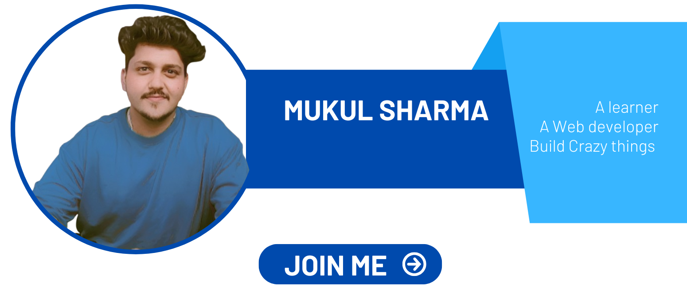

<!-- Top Banner -->

  

<h1 align="center">Hi 👋, I'm Mukul Sharma</h1>
<h3 align="center">Full Stack Developer | Laravel & Python Enthusiast</h3>

<!-- Typing Animation -->

  

---

## 🌐 Connect With Me

<!-- YouTube -->

<!-- CodePen -->

<!-- LinkedIn -->

<!-- Instagram -->

<!-- Facebook -->

<!-- Twitter -->

---

## 🚀 About Me
- 🔭 Learning **Laravel**, **Python Automation**, and **Full Stack Web Development**
- 💡 Enjoy creating tools, apps & solving problems  
- 👨‍💻 Always improving and exploring new technologies  
- 📫 Email: mukulshar456@gmail.com

---

## 🛠 Tech Stack

### 🔹 Languages

### 🔹 Frameworks & Tools

---

## 📊 GitHub Stats

  
  

---

## 🐍 Contribution Snake Animation

  

---

## 🏆 GitHub Trophies

  

---

## ⚡ Fun Fact
💬 *I improve every day by learning and building something new!*

---

⭐ **Thanks for visiting my profile — consider giving a ⭐ to any repo you like!**
